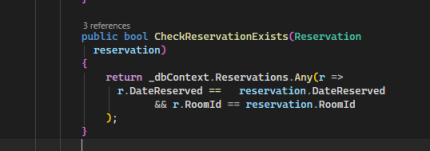
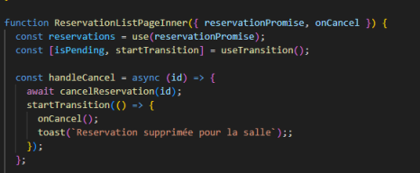

# DeskReserve – Client Ticket Analysis

**To:** [Manager / N+1 Name]  
**From:** Dennis Push Santillan 
**Date:** 09/04/2026  
**Subject:** Technical analysis and impact assessment – DeskReserve client feedback

---

## Context

Following the email received from the DeskReserve client (Jean-Marc), several issues and feature requests were reported regarding the current application.  
Below is a preliminary technical assessment of the requests, the potential implementation impact, and points requiring clarification.

---

## 1. Multiple reservations for the same desk

### Technical analysis
The Issue was rooted within the database verification process, the same was found after thorough analisys, having corrected the method (Image below shows the bug already fixed)

- 

which was supposed to correlate the existence of a booking having done in advance against a conferensce room under the same date

### Impact of the correction
The correction has properly fixed the bug unabling several bookings on the same date to be done against the same conference room

---

## 2. Application freeze when cancelling a reservation

### Technical analysis

The source of the problem was a tricky typo error, basically the method in charge of the cancellation process was attempting to pull the deleted data, triggering a conflict unabling the reservation page to refresh correctly (code source provided below alreade displaying the corrections done)

- 

### Impact of the correction
[Explain the technical changes required, e.g., frontend state handling, API error handling, React component lifecycle, etc.]

---

## 3. Reservation confirmation email

### Functional request
The client requested that the system automatically send a confirmation email to the user once a reservation has been validated.

### Blocking element / missing information
To implement this feature, the following information is currently missing:

- [Email service or SMTP configuration]
- [Sender email address / domain configuration]
- [Email template or content validation]

### Technical proposal
A possible implementation could involve integrating an email delivery service or library on the backend to automatically trigger a confirmation email after a successful reservation creation.

---

## 4. Request for mobile application publication

### Analysis

The client requested that the application be available on:

- Apple App Store
- Google Play Store

### Technical justification (out of scope)

The current platform is a **web application built with React**.  
Publishing the application on mobile stores would require:

- Developing a **native or hybrid mobile application**
- Adapting the UI and navigation for mobile platforms
- Managing mobile build pipelines and store submission processes

This represents a **separate development project**, which falls outside the scope of the current maintenance and bug-fixing tasks.

---

## Proposed team meeting agenda

To properly address this client ticket, I suggest a short team meeting with the following agenda:

1. Validate the root cause and fix for the double reservation issue
2. Investigate the cancellation bug affecting the frontend
3. Define the architecture for implementing reservation confirmation emails
4. Clarify the scope regarding the mobile application request
5. Prioritize tasks and estimate development time

---

## Conclusion

Please let me know if you would like me to proceed with the proposed corrections or if we should first validate the scope and prioritization with the team.

Best regards,

Dennis Puch Santillan  
Junior Dev. at Odoo